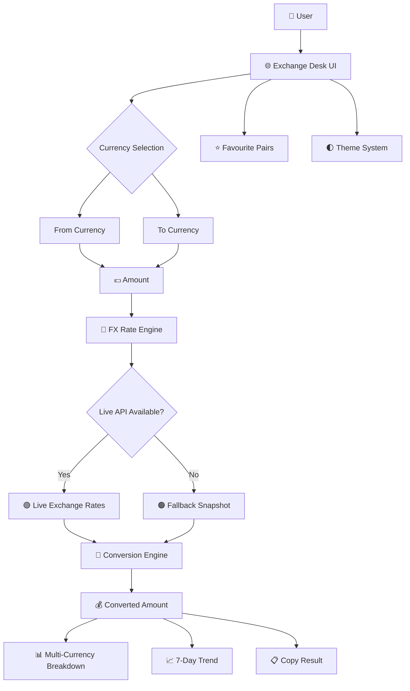

# 💱 Exchange Desk — Currency Converter

<p align="center">
  <strong>A modern, responsive multi-currency converter with live FX rates, historical trends, favourites, and a premium financial-dashboard interface.</strong>
</p>

<p align="center">
  
  
  
  
</p>

<p align="center">
  
  
  
  
</p>

---

## 📌 Overview

**Exchange Desk** is a browser-based currency conversion application designed with a premium financial-terminal aesthetic.

It allows users to convert currencies, view exchange rates, inspect short-term trends, save favourite currency pairs, and compare a converted amount across multiple currencies.

The application is built entirely with:

```text
HTML
CSS
JavaScript
```

No backend is required.

---

# ✨ Key Features

### 💱 Currency Conversion

Convert amounts between supported currencies with instant client-side calculations.

Example:

```text
1,000 USD
     ↓
INR
     ↓
₹95,600
```

The application supports both directions, meaning users can edit either the source or converted amount.

---

### 🌍 30+ Currencies

The application includes currencies such as:

```text
🇺🇸 USD — US Dollar
🇪🇺 EUR — Euro
🇬🇧 GBP — British Pound
🇯🇵 JPY — Japanese Yen
🇮🇳 INR — Indian Rupee
🇦🇺 AUD — Australian Dollar
🇨🇦 CAD — Canadian Dollar
🇨🇭 CHF — Swiss Franc
🇨🇳 CNY — Chinese Yuan
🇸🇬 SGD — Singapore Dollar
🇦🇪 AED — UAE Dirham
🇸🇦 SAR — Saudi Riyal
🇰🇷 KRW — South Korean Won
🇿🇦 ZAR — South African Rand
🇧🇷 BRL — Brazilian Real
🇲🇽 MXN — Mexican Peso
...and more
```

The currency catalogue and names are defined directly in the application.

---

### 📡 Live Exchange Rates

The application attempts to retrieve current exchange rates from external FX APIs.

It uses multiple rate sources and automatically tries another source if the first one fails.

The interface clearly indicates whether the application is operating with:

```text
🟢 Live
```

or:

```text
🟠 Snapshot
```

---

### 🛡️ Fallback Rate System

If live rate sources cannot be reached, the application switches to a predefined exchange-rate snapshot rather than completely failing.

```text
Live API
   ↓
Available?
 ┌───────┴───────┐
YES             NO
 ↓               ↓
Live Rates   Fallback Snapshot
```

The fallback snapshot is explicitly dated in the application.

---

### 📈 7-Day Currency Trend

Exchange Desk retrieves historical rates and generates a compact 7-day sparkline.

Users can see:

```text
USD / INR

╱╲
  ╲╱╲___
       ╲╱
```

The interface also displays the percentage movement over the available period.

---

### ⭐ Favourite Currency Pairs

Users can save frequently used currency pairs.

For example:

```text
⭐ USD → INR
⭐ EUR → USD
⭐ GBP → INR
```

Favourites are stored locally using browser `localStorage`, with up to 10 saved pairs.

---

### ⚡ Quick Currency Pairs

The application provides commonly used conversion pairs for faster access:

```text
USD → INR
EUR → USD
GBP → USD
USD → JPY
USD → CNY
EUR → GBP
AUD → USD
USD → SGD
```

---

### 🔄 Currency Swap

Switch the source and destination currencies instantly using the swap button.

```text
USD → INR
   ↕
INR → USD
```

---

### 📊 Multi-Currency Breakdown

The application can display the converted amount across several currencies simultaneously.

```text
                 $1,000 USD
                     │
       ┌─────────────┼─────────────┐
       ↓             ↓             ↓
    EUR           GBP           INR
    856           735         95,600
```

---

### 🌓 Dark & Light Mode

Exchange Desk includes a theme switcher supporting:

```text
🌙 Dark Mode
☀️ Light Mode
```

The interface uses CSS custom properties to dynamically change the application's colour system.

---

### 📋 Copy Result

Users can copy a conversion result directly to their clipboard.

Example:

```text
1,000 USD = 95,600 INR
```

---

# 🧠 Application Architecture



---

# 🔄 Data Flow

```text
User Input
    ↓
Currency Selection
    ↓
Fetch Exchange Rates
    ↓
Live API
    │
    ├── Success → Live Rates
    │
    └── Failure → Snapshot Rates
    ↓
Calculate Conversion
    ↓
Display Result
    ↓
Trend + Breakdown + Quick Pairs
```

---

# 🛠️ Technology Stack

| Technology      | Usage                      |
| --------------- | -------------------------- |
| 🟧 HTML5        | Application structure      |
| 🎨 CSS3         | Responsive UI & animations |
| 🟨 JavaScript   | Application logic          |
| 🌐 Fetch API    | Exchange-rate requests     |
| 💾 LocalStorage | Favourite pairs            |
| 📈 SVG          | Sparkline visualization    |
| 🔤 Google Fonts | Typography                 |

The interface uses **Fraunces**, **Space Mono**, and **Manrope** to create its financial-ledger visual identity.

---

# 🎨 Design System

The application follows a premium financial-dashboard aesthetic.

### Visual Characteristics

```text
┌──────────────────────────────────────┐
│ 💱 Exchange Desk       🟢 Live  ☀️  │
├──────────────────────────────────────┤
│ USD                         INR      │
│ $ 1,000          ⇄          ₹95,600 │
│                                      │
│ 1 USD = XX.XXXX INR                  │
│                                      │
│ 📈 7-day trend                       │
│ ╱╲___╱╲                              │
│                                      │
│ Multi-currency breakdown             │
│ EUR      GBP      JPY                │
└──────────────────────────────────────┘
```

## The UI includes responsive layouts, animated transitions, focus states, and reduced-motion support.

# 📱 Responsive Design

The interface adapts to smaller screens.

On desktop:

```text
FROM  →  SWAP  →  TO
```

On smaller screens:

```text
FROM
  ↓
SWAP
  ↓
TO
```

This responsive behaviour is implemented through CSS media queries.

---

# 📂 Project Structure

```text
📦 Exchange-Desk
│
├── 🌐 M20.html
│
├── 📖 README.md
│
└── 📁 assets/
    └── 🖼️ preview.png
```

If the application is renamed to `index.html`, it can be deployed directly as a static website.

---

# 🚀 Getting Started

## 1. Clone the Repository

```bash
git clone https://github.com/YOUR_USERNAME/exchange-desk.git
```

## 2. Open the Project

```bash
cd exchange-desk
```

## 3. Run

Simply open:

```text
M20.html
```

in your browser.

For local development, you can also use a simple HTTP server:

```bash
python -m http.server 8000
```

Then open:

```text
http://localhost:8000
```

---

# 🌐 Deployment

Because this is a client-side HTML/CSS/JavaScript application, it can be deployed using static hosting platforms such as:

* GitHub Pages
* Netlify
* Vercel
* Cloudflare Pages

No application server is required for the core interface.

---

# 🔐 Data & API Behaviour

The application attempts to obtain exchange rates from external public rate sources.

If live sources fail:

```text
API Failure
     ↓
Fallback Snapshot
     ↓
Application continues working
```

This makes the application more resilient to temporary API failures.

---

# ⚠️ Disclaimer

Exchange rates are provided for **reference and educational purposes only**.

The application itself states that its rates should not be considered financial advice.

For financial transactions, always verify rates, fees, taxes, spreads, and transfer charges with the relevant financial institution.

---

# 🔮 Future Improvements

Potential upgrades include:

* [ ] Currency conversion fees
* [ ] Bank transfer fee comparison
* [ ] Tax/GST estimation
* [ ] International transfer comparison
* [ ] Historical exchange-rate charts
* [ ] Longer-term FX analytics
* [ ] Currency alerts
* [ ] Rate-change notifications
* [ ] PWA support
* [ ] Offline caching
* [ ] More detailed economic indicators
* [ ] Mobile-first redesign
* [ ] Currency news integration
* [ ] User accounts and cloud favourites

---

# 🎯 Project Vision

The long-term goal is to evolve **Exchange Desk** from a simple currency converter into a broader **personal FX intelligence platform**.

```text
Currency Converter
       ↓
FX Dashboard
       ↓
Transfer Cost Comparison
       ↓
Tax & Fee Intelligence
       ↓
Currency Analytics
       ↓
🌍 Global Money Intelligence Platform
```

---

# 👨‍💻 Author

## Aravind

**AI & Data Science Student | Developer | Data & Finance Enthusiast**

<p align="center">
  <strong>Building practical technology at the intersection of software, data and finance. 🚀</strong>
</p>

---

# ⭐ Support

If you like this project:

⭐ Star the repository
🍴 Fork it
🐛 Report bugs
💡 Suggest features
📢 Share it

---

<p align="center">

### 💱 Convert • 📊 Analyze • 🌍 Understand

**Exchange Desk — A modern approach to currency conversion.**

</p>
